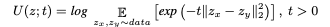
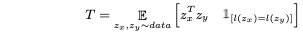

# Uniformity_tolerance

The uniformity and tolerance analysis are inspired from [here](https://openaccess.thecvf.com/content/CVPR2021/papers/Wang_Understanding_the_Behaviour_of_Contrastive_Loss_CVPR_2021_paper.pdf). As mentioned in the paper, uniformity and tolerance are important measurements for feature quality.

In order to analyze the reason why ACL loss brings improvement in performance. We analyze the feature embeddings from  uniformity and tolerance point of view with respect to different temperature.

 The motivation of applying ACL is demonstrated [here](https://github.com/shanwangshan/problems_of_infonce), the Self-supervised ACL is implementated [here](https://github.com/shanwangshan/Self_supervised_ACL), and the supervised ACL is implementated [here](https://github.com/shanwangshan/supervised_ACL). For more details, please see from our paper *"Self-supervised learning of audio representations using angular contrastive loss"*.

### Uniformity

Uniformity is calculated as below,

### Tolerance

Tolerance is calculated as below,

### Calculate uniformity or tolerance

Here we provide the pre-calculated feature embeddings from different temperature modalities. e.g., t0.1 indicates the model trained on normal contrastive loss and temperature is set to 0.1. t0.1a0.7 represents the model trained on ACL loss with temperature 0.1 and alpha 0.7.

`` python uniformity.py/tolerance.py ``

### Results
| temperature | uniformity (baseline) | uniformity (ACL) | tolerance | tolerance (ACL) | linear_probe (baseline) | linear_probe (ACL) |
|-------------|-----------------------|------------------|-----------|-----------------|-------------------------|--------------------|
| 0.1         | 0.3976                | 0.2447           | 0.9113    | 0.9471          | 77.081                  | 78.356             |
| 0.2         | 0.3719                | 0.2605           | 0.9189    | 0.9437          | 74.160                  | 77.070             |
| 0.3         | 0.2954                | 0.1874           | 0.9357    | 0.9437          | 75.570                  | 75.615             |
| 0.4         | 0.3126                | 0.1733           | 0.9328    | 0.9632          | 75.175                  | 75.389             |
| 0.5         | 0.3377                | 0.1944           | 0.9269    | 0.9589          | 74.893                  | 77.149             |
| 0.6         | 0.3106                | 0.1839           | 0.9339    | 0.9601          | 75.626                  | 77.645             |
| 0.7         | 0.3166                | 0.2118           | 0.9301    | 0.9532          | 75.897                  | 76.664             |
| 0.8         | 0.3129                | 0.1512           | 0.9329    | 0.9684          | 74.126                  | 75.276             |
| 0.9         | 0.2680                | 0.2052           | 0.9440    | 0.9595          | 72.930                  | 76.810             |
| 1.0         | 0.3560                | 0.1530           | 0.9271    | 0.9676          | 71.329                  | 75.964             |
### Plot the figure

``python plot.py``

### Acknowledgement

We wish to thank Wang et.al. for their detailed analysis on the contrastive loss ([link_here](https://openaccess.thecvf.com/content/CVPR2021/papers/Wang_Understanding_the_Behaviour_of_Contrastive_Loss_CVPR_2021_paper.pdf)).
